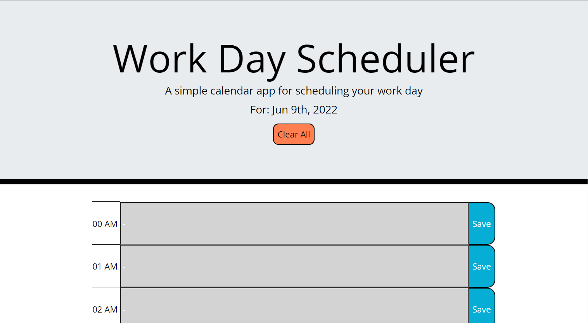
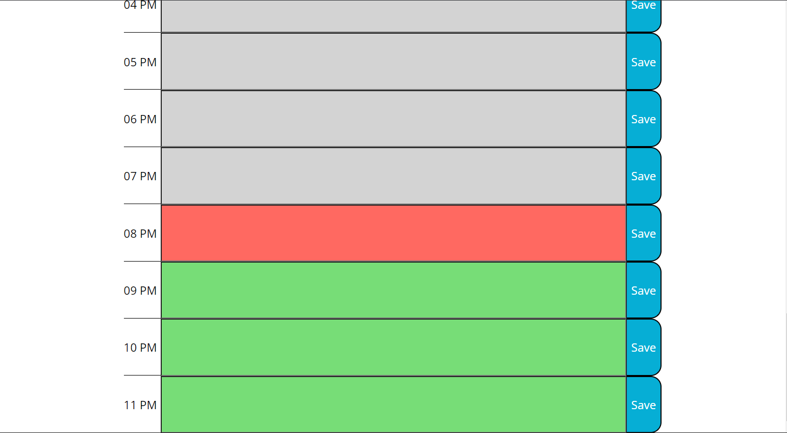

## Description
Hi, there! This is an application that can help you to schedule your work more efficiently. This application divide each day into 24 hour blocks and marks one of the blocks red to represent current time and events, all the blocks after that block green to represnet future time and events, and all the blocks before that block grey to represent past time and events. You can add the description of all the events in your schedule into the corresponding block. If you want to clear all the events, simply click 'Clear All' button to clear everything.

This package of code contains a html, a css, a javascript file as usual, as well as an readme file and .gitignore file. The css and javascript file are stored in the 'assets' folder, adn the rest of files are store in the root folder.
## Screenshot

## Link to Deployed Application
https://wodemingzijiaojianhao.github.io/diliugezuoye/
